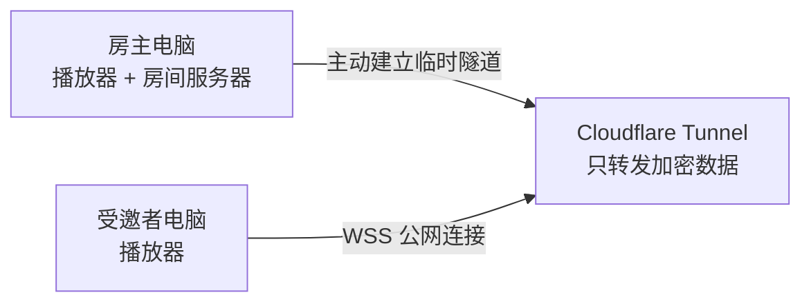

# 声笺 Music Bar

一个精简、置顶、可拖动的 Windows 网页音乐栏。它可以载入 Bilibili、BV 号以及包含 HTML5 音视频的网页，并让两台位于不同网络的电脑通过互联网一起听。

## 功能

- 无边框桌面级音乐栏，非按钮区域均可拖动。
- 播放、暂停、快进、进度、音量、静音与音频输出设备选择。
- 历史网页自动记忆，可创建多个歌单，并支持改名、排序、删除、JSON 导入和导出。
- 导入网页或歌单时可选择在隔离、无登录状态的静音后台读取视频标题、作者、封面与关键词；手动名称不会被覆盖。
- 房主电脑保存房间状态，不需要另购服务器或配置端口转发。
- 本地歌单可一键创建互联网房间；双方均可添加、改名、删除、排序、选曲、切换上下首和拖动播放进度。
- 挑战认证、AES-256-GCM 端到端加密、重放保护与单访客限制。

## 工作方式



房主服务只监听 `127.0.0.1`，不会在家庭路由器或局域网中开放端口。应用自动启动官方 `cloudflared`，生成临时 `wss://*.trycloudflare.com` 地址。Cloudflare 可以观察连接时间和流量大小等元数据，但房间歌单与控制消息在应用层端到端加密。

## 使用

系统要求：Windows 10/11 x64。

1. 双方运行同一版本的声笺 Music Bar。
2. 房主点击“一起听”图标，再选择“创建互联网房间”。
3. 等待公网地址生效，通常需要数秒，首次 DNS 生效有时可能接近 45 秒。
4. 房主复制 `MB1.` 开头的邀请，只发给要一起听的人。
5. 受邀者粘贴邀请并加入。

也可以在“历史与歌单”中创建歌单，从最近网页加入内容，再点击“一起听”。歌单的名称、网页顺序和自动识别到的视频信息会随导入、导出和分享保留。房主与受邀者拖动顶部进度条后，以最后一次操作为准同步到双方。

邀请内容相当于临时房间密码。房主关闭应用后，房间和公网隧道都会结束。

> 当前使用免费的 Cloudflare Quick Tunnel。它无需 Cloudflare 账户，但官方将其定位为测试和开发用途，不提供可用性保证；断开时重新创建房间即可。WebSocket 由 Cloudflare Tunnel 官方支持。

## 从源码安装

需要 Node.js 22.13 或更高版本，推荐 Node.js 24。

```powershell
git clone https://github.com/CFFCOverman/Music-Bar.git
cd Music-Bar
npm ci
npm run desktop
```

`npm ci` 会执行 `scripts/setup-cloudflared.cjs`：从 Cloudflare 官方固定版本下载 Windows x64 组件，核对 SHA-256，并验证签名者为 Cloudflare, Inc.。下载的 54 MB 二进制不会提交到 Git 仓库。

## 测试与打包

```powershell
npm run check
npm test
npm run desktop:pack
```

便携版输出到 `release/Shengjian-Music-Bar-<版本>.exe`。

仓库包含 `Windows clean install` GitHub Actions 工作流。每次推送都会在新的 `windows-latest` 环境中执行锁文件安装、语法检查、加密房间协议测试和完整打包，并保留 14 天的便携版构建产物。

## 目录

```text
src/
  main/
    index.cjs            Electron 主入口和 IPC
    media.cjs            隐藏网页与媒体控制
    metadata.cjs         导入网页的静音后台名称识别
    room.cjs             加密房间协议
    room-controller.cjs  房间、播放和 UI 协调
    store.cjs            历史、歌单与设置
    tunnel.cjs           Cloudflare 临时公网隧道
  renderer/              桌面音乐栏界面
  preload.cjs            安全的渲染层接口
scripts/                 安装与检查脚本
test/                    Node.js 协议测试
vendor/                  第三方声明和许可证
```

## 安全边界

- 房间令牌为 256-bit 随机值，不会直接在 WebSocket 中发送。
- 双方通过 HMAC 挑战证明持有邀请，再用 HKDF 派生方向独立的 AES-256-GCM 密钥。
- 消息计数器、AAD 和认证标签用于拒绝乱序、重放与篡改。
- 每个房间最多一位受邀者，输入、URL、消息体和请求频率均有限制。
- 邀请泄露后，持有者可以尝试加入；请把邀请当作密码。
- 导入文件不会直接继承浏览器登录状态；只有确认“读取名称”后才会访问其中的公网网页，并拒绝本机与私网地址。
- 网页媒体仍由各自电脑直接访问原网站，并受原网站登录状态、地区限制和播放策略影响。

## 第三方组件

`cloudflared` 由 Cloudflare, Inc. 提供，采用 Apache License 2.0。固定版本、校验值、项目链接与完整许可证位于 `vendor/`。

- [Cloudflare Tunnel 文档](https://developers.cloudflare.com/tunnel/)
- [Quick Tunnel 限制](https://developers.cloudflare.com/cloudflare-one/networks/connectors/cloudflare-tunnel/do-more-with-tunnels/trycloudflare/)
- [Cloudflare WebSocket 支持](https://developers.cloudflare.com/cloudflare-one/faq/cloudflare-tunnels-faq/)
